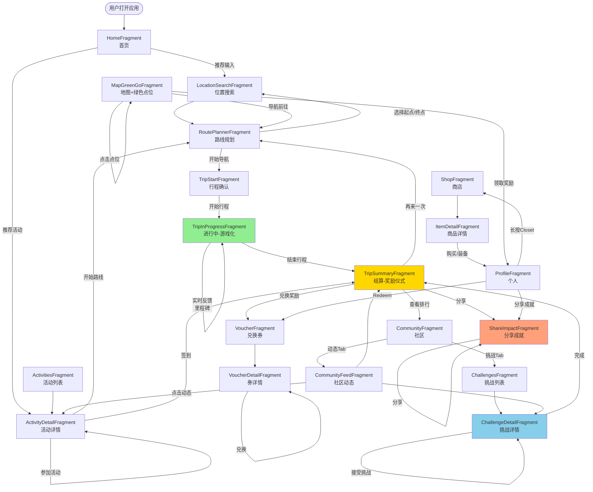
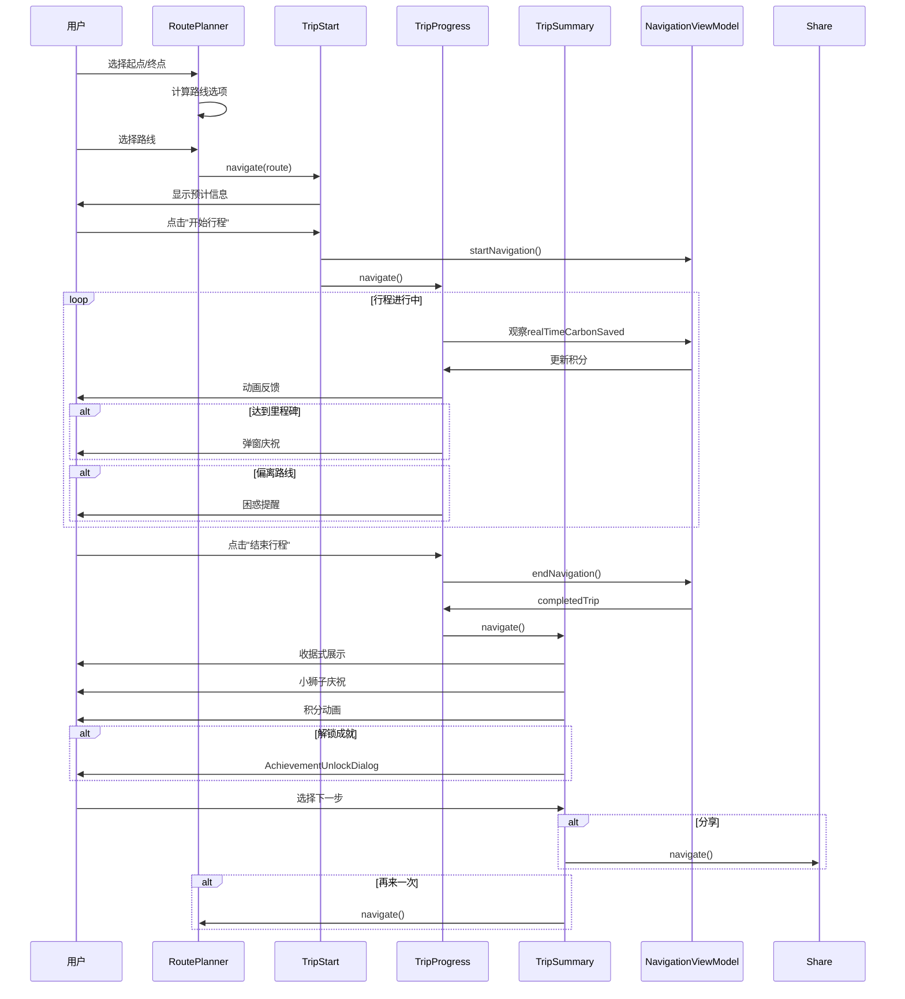
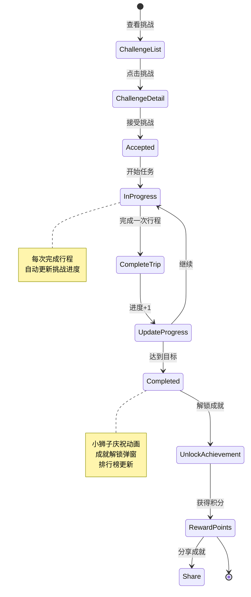
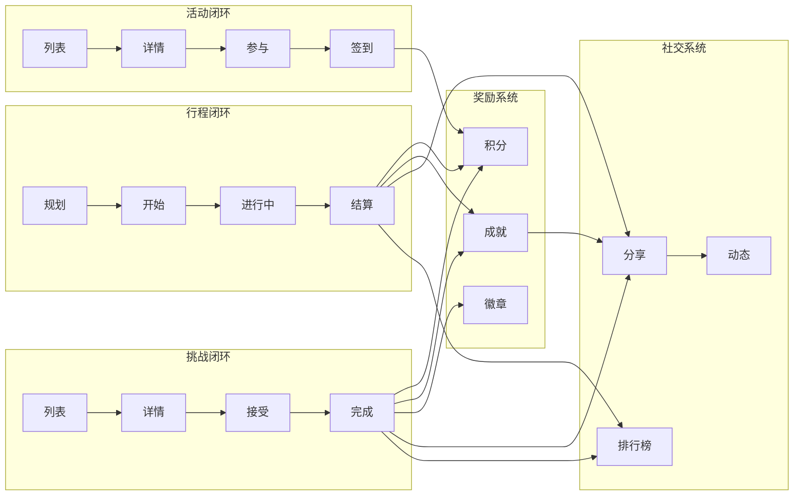

# EcoGo Android 游戏化闭环流程图

## 完整游戏化系统架构

---

## 核心闭环详解

### 1. 行程闭环（主线）

---

### 2. 挑战系统流程

---

### 3. 多闭环交互图

---

## 游戏化设计原则应用

### 即时反馈
- ✅ TripInProgress - 实时积分累积
- ✅ 里程碑弹窗 - 每1km庆祝
- ✅ 小狮子动态表情 - 根据状态变化

### 奖励仪式感
- ✅ TripSummary - 收据式展示
- ✅ ValueAnimator - 积分增长动画
- ✅ AchievementUnlock - 成就解锁弹窗
- ✅ 环保等级 - A+/A/B评分

### 循环引导
- ✅ 每个终点都是下一个起点
- ✅ TripSummary提供4个下一步选择
- ✅ 挑战系统推动持续参与

### 社交分享
- ✅ 生成精美分享卡片
- ✅ 一键分享到社交平台
- ✅ 社区动态信息流

---

## 闭环完成度评分

| 闭环 | 完成度 | 核心功能 |
|------|--------|----------|
| 行程闭环 | ⭐⭐⭐⭐⭐ 100% | 规划→执行→奖励→分享 |
| 活动闭环 | ⭐⭐⭐⭐⭐ 100% | 浏览→参与→签到→奖励 |
| 挑战闭环 | ⭐⭐⭐⭐⭐ 100% | 接受→完成→解锁→分享 |
| 券包闭环 | ⭐⭐⭐⭐⭐ 100% | 兑换→使用→完成 |
| 商店闭环 | ⭐⭐⭐⭐☆ 95% | 浏览→试穿→购买→装备 |
| 地图闭环 | ⭐⭐⭐⭐⭐ 100% | 发现→导航→领取→分享 |

**总体完成度：99%**

---

**更新日期**：2026-02-02  
**版本**：2.0.0  
**状态**：✅ 所有功能已实施
